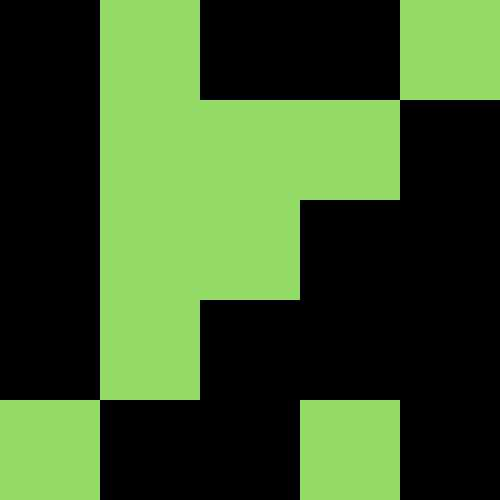
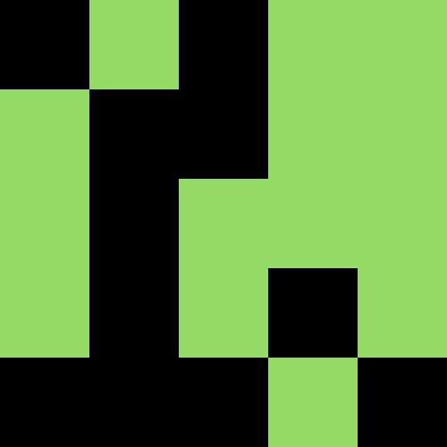
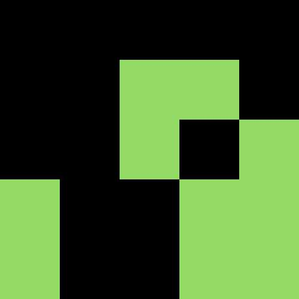
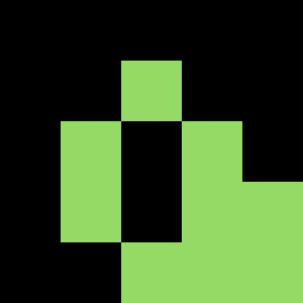
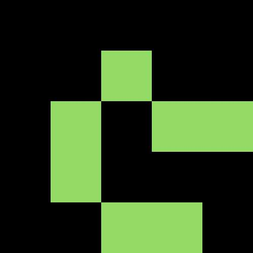
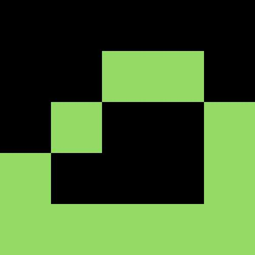
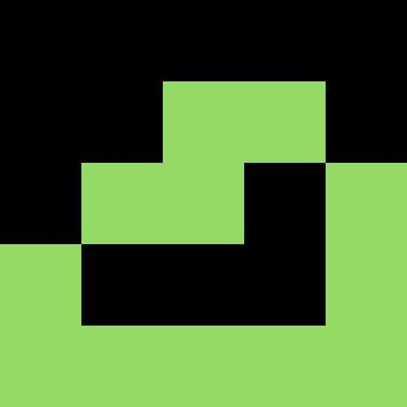
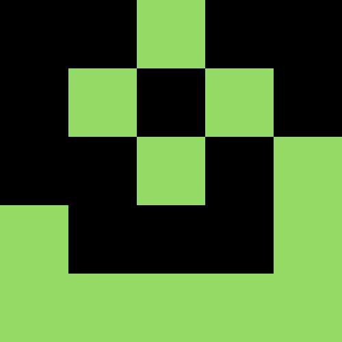

# gameoflife
John Conway's  Game of Life


## example

```
package main

import(
	gl "github.com/nichtsen/gameoflife" 
)

func main() {
	//board length, width,
	//and block length by pixels
	width, len, unit := 5, 5, 100
	//1 for alive 0 for dead
	b, err := gl.NewBlock(
		width,
		len,
		[]byte{
		0,1,0,0,1,
		0,1,1,1,0,
		0,1,1,0,0,
		0,1,0,0,0,
		1,0,0,1,0},
	)
	if err != nil {
		panic(err)
	}
	br := gl.NewBoard(&b, unit)
	// transition for 10 times
	br.Transition(10)
}
```










